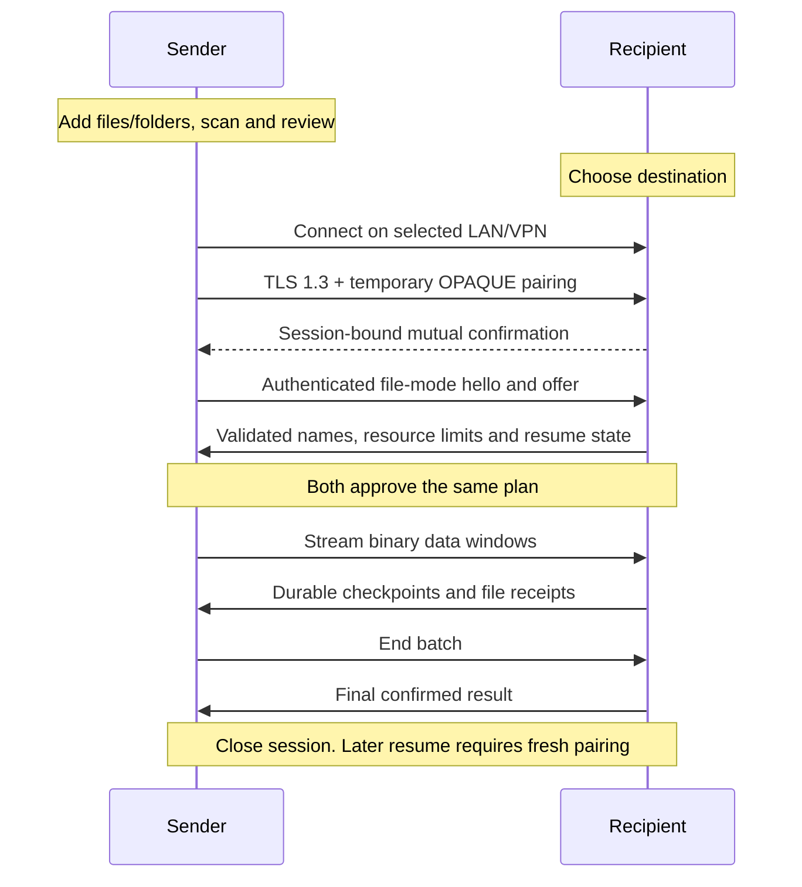

# Design

## Context

See [proposal.md](proposal.md) for motivation and [the capability spec](specs/device-file-exchange/spec.md) for the behavior contract.

Observed implementation:

- `src/shared/ExchangePage.tsx` exposes one full-workspace exchange flow, polls status every second, and stops on page unmount/document hiding. `sync/session.rs::exchange_workspace` captures a vault snapshot before exchanging summaries and binding mutual approval.
- `sync/auth.rs` uses channel-bound OPAQUE over TLS 1.3. Its exact protocol identifier also binds authentication. Its JSON framing flushes each message and sockets have ten-second read/write timeouts.
- `sync/network.rs` already implements selected-interface listening/source binding, same-link automatic LAN selection, explicitly selected routed private/VPN access, Tailscale's shared IPv4 range, private IPv6, bounded OS DNS, and manual endpoint entry. VPN discovery is intentionally absent.
- `sync/engine.rs` transfers attachments as base64 JSON in 256 KiB chunks, calls `sync_data` for every received chunk, and limits blobs to 512 MiB and staging/cache to 1 GiB. Vault snapshots copy attachment blobs before sending. These choices are unsuitable for general large-file transfer but remain valid boundaries for existing vault behavior.
- `sync/files.rs` has Unix/Windows durability helpers, including writable flush handles and Windows Unicode write-through manifest publication. `portability/file_boundary.rs` covers single output names and whole-buffer writes; it does not provide race-resistant recursive tree access or streaming batch publication.
- Android's `mobile_pick_files_cmd` delegates to `NativeServicesPlugin.kt`, which copies up to 100 documents into a temporary cache and limits a batch to 1 GiB. Its backup picker already uses document-tree grants. `onPause` ends exchange authorization, and native picker activities also pause the app. The legacy cache cleaner removes old files after ten minutes.
- `local-network-sync` and `mobile-experience` are defined in the active `mobile-and-lan-sync` change; they are not main specs yet. Their broader authentication/native acceptance remains incomplete. This plan adds a separate capability and preserves vault semantics, without treating previous user testing as full acceptance.

## Goals / Non-Goals

**Goals:**

- Keep pairing, network policy, and lifecycle common while isolating ordinary file copying from vault replication.
- Start sending after metadata preparation and approval, without an obligatory full-content prehash, archive, or complete source copy.
- Bound memory and retransfer after failure; make durable progress, output publication, and completion receipts explicit.
- Treat desktop files and Android document providers as different native capabilities behind one transfer engine.

**Non-Goals:**

- Directory synchronization, remote browsing, delete propagation, simultaneous bidirectional file transfer, multiple recipients, permanent trust, automatic reconnect, or background mobile service.
- Public endpoint support, embedded VPN/NAT traversal, app-operated relays, or a promise that every VPN implementation permits incoming peer connections.
- Filesystem snapshot semantics for actively edited folder trees, permissions/ownership/ACLs, symlinks, reparse traversal, hard-link identity, sparse-file layout, extended attributes, or automatic executable launch. Regular-file bytes, relative names, and directories are the portability contract; modified timestamps are best effort.
- iOS adapters in this change. Preserve its existing development status and expose file mode only where native access is implemented.

## Decisions

### 1. Extend the exchange shell with explicit transfer intent

Expose **Vault data** and **Files & folders** at the top of Device Exchange. File mode has **Send** and **Receive** roles. Source preparation and destination picking occur before **Enter exchange mode**, so Android system picker pauses cannot silently cancel a paired transfer. After pairing, the recipient can inspect and decline the offer; changing destination requires ending the session, selecting it, and pairing again.

The default recipient hosts the listener/code, and the sender connects. Transport connector/listener roles remain independent of file roles, so an existing discovered listener can be a sender when the other peer chooses Receive. File hello negotiation rejects two senders or two recipients.

Received output defaults to `<chosen destination>/Tenjee Received <date>-<short id>/`. A single file also uses this batch directory for consistent ownership, collision handling, and recovery. The selected folder's basename is retained inside the batch; individual selected files use their basename. Repeated root basenames get deterministic suffixes shown in preview. There is no overwrite/merge control in the initial release.

Alternative: a generic file picker inside the current vault approval. Rejected because it hides whether a whole workspace or selected files are authorized and makes Android picker lifecycle unsafe.

### 2. Keep a separate file engine and preserve the vault protocol

Add `src-tauri/src/file_exchange/` with `selection`, `manifest`, `codec`, `engine`, `journal`, `destination`, and platform adapter modules. This is a proposed organization, not existing code. `ExchangeManager` owns a discriminated intent and dispatches to the existing vault engine or new file engine after authentication. A session exposes typed vault/file status; file preparation does not acquire the vault snapshot/database locks.

Retain the current vault identifier `tenjee-lan-v1-opaque-ristretto255-sha512-tls13-entities2` and exact legacy framing/approval. File mode uses `tenjee-file-v1-opaque-ristretto255-sha512-tls13`. Parameterize the existing authentication composition with an allowlisted protocol choice, including every greeting, OPAQUE context, confirmation transcript, and exporter-domain use; never replace only the greeting string. File-mode clients require the file identifier before authentication and reject another mode. Older peers fail clearly without silent fallback. Discovery advertises public mode/version hints, which confer no trust and are checked again inside authentication.

Reuse `sync/network.rs` and the session's global attempt/expiry/cancellation controls. No persisted code or TLS session key. Transfer history and resume records convey no network authorization. Reused auth requires current OPAQUE/channel-binding and lifecycle acceptance; a new engine does not resolve the old checklist automatically.

Alternative: bump every peer to one new unified protocol immediately. Rejected to avoid unnecessarily breaking vault exchange with existing builds. Alternative: reuse `sync/engine.rs` blob transfer with larger constants. Rejected because it inherits vault schemas, base64, snapshot copies, and per-chunk flush costs.

### 3. Freeze a metadata manifest, then hash bytes while streaming

Prepare selection on native/Rust workers using no-follow traversal, deduplicate overlapping selected roots, and show exclusions before allowing an offer. Include hidden files visibly. Do not follow symlinks/reparse points or special files. Bound active source descriptors rather than opening every selected file at once.

Each local `SelectionHandle` resolves to a backend-owned native source, not a caller-supplied path trusted from JavaScript. Wire entries contain a sequential entry ID, path components relative to the batch, kind (`file`/`directory`), file size as `u64`, and optional modified time. Absolute paths, Android URIs, and grants are local-only. The frontend receives counts/byte lengths as decimal strings or safe derived display values, avoiding JavaScript integer rounding. Incrementally persist manifest entries to the local journal and read bounded pages for hashing, validation, and preview; the 64 MiB manifest budget is not permission to retain a 64 MiB manifest in RAM. Preview rows are paginated/virtualized.

A sender-generated batch UUID and 256-bit resume capability are retained locally. Hash a canonical, length-prefixed manifest encoding with SHA-256; do not hash ambiguous JSON object ordering. Bind both approvals to the authenticated session ID, file protocol/version, data direction, batch identity, manifest digest, exclusions, and receiver's accepted naming-plan digest. Receiver destination paths remain local and are locked to its journal. Any offer/mapping change revokes approval.

Opening each source revalidates its native identity, type, length, and version/mtime against preparation. Keep its handle open through that file's read and compare metadata again at end. Compute chunk and whole-file SHA-256 while sending; the receiver verifies chunks and computes the same whole-file hash before publication. No full prehash is required for a new normal file. This guarantees verified transmitted bytes, not a filesystem snapshot of an actively changing source. Detectable edits fail the affected entry and require a new offer; instruct the sender to close applications editing selected files. Folder additions after the frozen scan are excluded and reported as pending changes when detected.

Alternative: full archive/snapshot plus prehash of every selection. Provides stronger source immutability but doubles disk traffic/storage and delays the first byte. Use bounded per-file staging only for providers that require it, rather than making every transfer pay that cost.

### 4. Binary TLS streaming with bounded windows

Use one authenticated TCP/TLS connection per batch. TCP works through the existing LAN/private VPN route and lets the VPN manage its own transport. QUIC, extra parallel sockets, compression, and archives are deferred until measured need; none is necessary for the contract. An initial ordered stream also makes durable prefix recovery straightforward.

The file codec uses a validated length-prefixed binary envelope: frame type/flags, entry ID, offset, payload length, and bounded payload. Data frames carry raw bytes and a SHA-256 digest for their range; controls contain bounded JSON metadata with explicitly encoded wide integers. Entry start/end controls carry declared length and final hash. Reject unknown critical types, impossible states, duplicated/out-of-range offsets, and integer overflow before allocation/write. A frame is not a TLS record or a durability checkpoint.

Starting limits (tuning can tighten them without changing the contract):

| Resource | Initial bound / behavior |
| --- | --- |
| Data chunk | 1 MiB maximum; benchmark 256 KiB–1 MiB |
| Control frame | 256 KiB maximum; manifest sent in pages |
| Entries / depth | 100,000 entries; 128 components |
| Wire relative path | 4 KiB total UTF-8; destination-specific limits checked separately |
| Manifest metadata | 64 MiB encoded, including exclusions/mapping |
| Recovery metadata | 64 MiB per batch; estimate digest/receipt cost during preparation |
| Read-ahead / queues | 8 MiB source read-ahead; bounded queues; transfer working memory target below 64 MiB excluding app baseline |
| Outstanding window | 8 MiB initially, adapt within 8–32 MiB; also bounded by 1,024 pending file completions |
| Active batch | One session, one recipient; no unlimited worker or descriptor creation |
| File/batch bytes | Checked 64-bit lengths; governed by destination capability, available space, and metadata budgets rather than vault blob/cache limits |

Sender streams a window without waiting after every chunk/file. At `WindowEnd`, it flushes queued TLS data and reads the receiver's grouped durable checkpoint/receipts before advancing. Receiver reads the complete window and sends control replies at the defined boundary, preventing a synchronous full-duplex deadlock. Worker read/hash/write tasks have bounded queues and a single owner serializes TLS access. Receiver local cancellation shuts the socket immediately; neither side depends on delivery of a cancel control. Larger windows adapt to observed RTT/throughput within the bound; no per-file network roundtrip for small-file trees.

Flush network buffers at bounded intervals/bytes so small batches and Stop remain responsive. Check cancellation between native operations and use cancellable/polled socket I/O rather than an uninterruptible `write_all` of an unlimited body. Do not inherit a ten-second total/approval deadline from the auth phase. File mode uses phase-specific polling/watchdogs: bounded connection/auth budgets, a 120-second no-progress transfer deadline, and the shared 30-minute meaningful inactivity limit. Approval waiting uses bounded waiting-state messages on the file codec; transport keepalives do not renew user authorization. Poll at approximately one second so Stop is timely. A slow but progressing transfer remains authorized.

Alternatives: stop-and-wait per chunk/file wastes VPN RTT; unlimited pipelining risks memory/storage exhaustion. Multiple connections would require new session-bound channel authorization and complicate resume. The initial windowed single-stream implementation is benchmarked before considering them.

### 5. Group durable checkpoints and make resume cryptographically specific

Use a separate local SQLite journal in an app-data `file-exchange` directory, excluded from vault snapshots, replication, and backup export. Persist batch/manifest/capability, local selection handles or grants, destination identity, naming map, per-file state, verified chunk hashes, durable offset, final hash, and publication receipt. The Android cache cleaner must never touch this directory. Restrict permissions where supported; ordinary selected/received file content remains subject to native storage protection rather than vault encryption.

While receiving, hash/validate bytes and write an owned `.part` file. Checkpoint at complete chunk boundaries after approximately 8 MiB or two seconds of incoming data, and at file/window completion. First flush file data; then commit durable offset and chunk hashes in the journal with an appropriate durable SQLite policy. Never advance a durable receipt before file flush and journal commit. `WindowEnd` forces remaining pending checkpoints; already durable local progress can exceed the last receipt the sender saw.

Preflight available destination space against remaining output bytes plus metadata and a 32 MiB reserve when the platform supplies reliable free-space information. Android staging requires additional app-private capacity for the largest active file, plus any disclosed staged source. Recheck during writes; a preflight estimate cannot reserve space against other apps. Providers with unknown capacity display that limitation and still enforce write-error handling. Unexpected source/I/O/integrity failure stops the batch with valid completed output retained and remaining entries pending; it never converts an accepted entry to a silent skip.

On recovery, truncate unjournaled tails and rehash retained chunks; lower the offset to the earliest corrupt range. Resume starts with fresh pairing and the sender's retained random capability over the new encrypted channel, plus the same manifest/plan, then requires approval again. Merely knowing a batch ID, name, length, or peer label is insufficient. Reuse no old TLS keys and accept no persistent peer identity as authorization.

Before skipping a retained prefix, sender reopens/revalidates the source and hashes its prefix against the stored source chunk digests or authenticated receiver checkpoint digests. Hash the prefix locally into the full-file hasher, then stream the missing suffix. The receiver likewise seeds its full-file hasher from its verified prefix. This costs disk reads on resume but avoids retransferring verified bytes and detects same-length source changes; sender edits do not silently splice old receiver bytes into a new file. A changed prefix yields a visible changed-source error and a new offer/restart action. Providers that cannot reopen/seek require staged bytes or a restart, explained before approval.

Completed-file receipts include batch, entry, approved name, exact size/hash, and publication status. Recovery verifies the retained output before treating its receipt as reusable; missing/edited completed output is not automatically overwritten. Lost acknowledgements are reconciled in a newly approved session without duplicating files. Sender stays **unconfirmed** until recipient receipts arrive. Batch success requires all accepted files/directories finalized, excludes acknowledged selection exclusions from the accepted set, and includes them explicitly in the result.

Alternative: resume from `.part` length only. Rejected because length does not prove durability, integrity, source identity, or authorized batch ownership.

### 6. Publish safely within a pinned destination

Receive into a new batch root created exclusively below the user-selected directory. Partial data is in an owned hidden staging area on the same filesystem, avoiding a second full copy for desktop output. Pin destination directories with native handles; operate on validated components relative to those handles using no-follow traversal. On Windows reject reparse-point traversal and use equivalent handle-based checks. Canonicalize-then-concatenate alone is insufficient under concurrent filesystem changes.

Validate traversal/absolute/UNC/drive paths, separators, NUL, Windows device names/alternate streams, path lengths, Unicode normalization and case-insensitive collisions, and file-versus-directory collisions. Preserve supported Unicode names. Resolve legal duplicate names deterministically in the naming plan; reject names that cannot be represented safely instead of silently sanitizing them. Non-UTF-8 desktop names are explicit exclusions in version 1. Recheck exclusive creation at publication, since destination contents can change after preview.

Publication ordering: verify full size/hash and flush the writable partial; durably record `ready-to-publish` and its planned output; publish with same-volume atomic no-replace semantics; flush directory/publication state using tested Unix/Windows operations; commit the completed receipt; only then acknowledge. Recovery inspects both partial and final output plus hash/identity to resolve a crash between publication and receipt. Use platform no-replace rename or a verified safe equivalent; do not assume the existing manifest helper's ordinary rename cannot replace a target. Never replace an existing file as a recovery shortcut. A completed batch is not an all-or-nothing transaction: valid files may remain after interruption and the UI reports that explicitly.

If destination filesystems cannot provide the required no-replace/durable behavior, offer a compatible destination with an explanation rather than claiming unsupported guarantees. Local working data and received output are ordinary files; receipt state does not make them encrypted vault content. Do not auto-open content after receiving.

### 7. Android adapter uses provider capabilities, not simulated paths

Add native multiple-document and document-tree commands to the current Android services adapter. Source selection uses `ACTION_OPEN_DOCUMENT` with multiple selection and source folders use `ACTION_OPEN_DOCUMENT_TREE`; receiver destination is a separate selected tree. Retain only grants returned by the OS and use `ContentResolver`/document APIs to enumerate and access descendants. Android 11 restrictions apply to roots, Downloads root, and protected app directories; explain permitted alternatives. [Android storage access documentation](https://developer.android.com/training/data-storage/shared/documents-files).

Tauri's Android dialog plugin does not support folder picking, so the native tree adapter is necessary. [Tauri dialog documentation](https://v2.tauri.app/plugin/dialog/).

Bridge native descriptors to Rust where the provider returns seekable regular descriptors, with explicit ownership/close rules. For provider streams/pipes, keep bounded native streaming off the WebView; never pass payloads as base64 invoke results. Non-seekable or unknown-size sources use a disclosed per-file private staging copy subject to a user-visible disk budget, or are rejected if staging is infeasible. Persist staged sources until completion/discard under the transfer journal's ownership.

For receiving, use app-private staging for the active file and then copy verified bytes to a temporary document in a new batch tree. Re-read/hash provider output before marking saved. If the provider supports safe rename, publish the temporary document and persist its receipt. Providers without suitable rename/no-replace operations require a disclosed **saving** phase; an incomplete provider document may be visible and cannot be represented as a completed file. Retain/reconcile that document on interruption, or reject destinations where completion cannot be reliably distinguished. Remote/provider durability beyond a successful API close and readback is not guaranteed; the preview states this, and does not claim desktop `fsync` semantics. Storage accounting includes both the private active-file staging and destination copy.

Use a scoped keep-screen-on hint while active; keep foreground-only authorization and stop on real suspension. Do not exempt arbitrary picker pauses after pairing; finish picking before start. No filesystem-path coercion, broad storage permission, or reuse of the legacy import copy's 1 GiB batch limit. Preserve native edits in the reproducible Android source/build scaffold instead of relying on a local generated/untracked file.

### 8. Retain the existing network policy and make VPN performance observable

Use current eligible private/shared addresses and explicitly selected routed interfaces. Manual `hostname:port`, numeric IPv4, and bracketed IPv6 use the same bounded resolver and source binding. No automatic switching from an approved VPN route to LAN or a public address on failure. Users choose a route again when reconnecting. Android VPNs that prohibit incoming sockets or exclude this app are diagnosed as platform/VPN constraints.

Tailscale supplies overlay routing; Tenjee transfers encrypted application traffic to the tailnet address. MagicDNS uses the OS resolver. Tailscale may use direct, peer-relay, or DERP paths; direct paths generally provide better performance. The app does not infer the underlying path from a tailnet IP or label its TLS connection “direct.” [Tailscale connection types](https://tailscale.com/docs/reference/connection-types), [MagicDNS](https://tailscale.com/docs/features/magicdns).

Show selected network, endpoint, measured payload speed, file/byte counts, checkpointed progress, and ETA only after enough samples. Throttle progress events to roughly 4 Hz; retain snapshot polling for recovery/fallback. Distinguish Preparing, Awaiting approval, Transferring, Verifying, Saving, Complete, Partial, and Unconfirmed. **Pause** ends authorization and retains progress; **Resume** creates a new session. Final summaries offer Open destination, Resume pending, or Discard partial data. Cleanup is ownership-checked, retains pending batches at least seven days, and asks for explicit discard rather than deleting resume data under storage pressure.

### 9. Define speed and stability through reproducible acceptance

The 70% relative large-file target is a proposed acceptance target, not a current measurement or guaranteed absolute rate. Benchmark a minimal raw binary TLS streaming baseline with the same devices, disks, route, hashing, and durability cadence to isolate application overhead. Record payload throughput separately from total wall time, including scan, source verification, destination publication, and Android provider copies. Large-file performance cannot hide a slow preparation/saving phase.

Test profiles: controlled LAN; routed VPN with 20/80 ms RTT and bandwidth shaping; interruption profile with loss/drop/reconnect; real Tailscale cross-network route; another routed VPN. Record Tailscale direct/relay type through an available user-run diagnostic during validation, without making the installed CLI a runtime dependency. Use actual Windows/Linux and Android peers; macOS native filesystem behavior requires its own validation before declaring platform support.

Datasets: 4 GiB incompressible file; 8 GiB file to cross 32-bit limits; 10,000 × 4 KiB files plus nested/empty directories and Unicode/collision cases. Track phase timings, CPU, incremental RSS target below 64 MiB, queue bounds, first-byte preparation cost, durable-checkpoint delay, retransmitted bytes, and manifest/journal size. Tiny-file testing must show batching removes per-file RTT; disk flush cost is still real. Targets that fail need a recorded cause and corrective tuning, not a changed success label.

Inject interruption/crash before and after file flush, journal commit, hash verification, rename, directory flush, receipt commit, and final acknowledgement. Validate corrupted partials, edited sources, permission revocation, full disks, destination races, malformed frames, code/session expiry and Stop. Repeat unchanged batches via resume to establish no duplicates; a deliberately new send creates a new copy. Verify all vault-mode regressions after shared shell/auth changes.

## Risks / Trade-offs

- [Single TCP stream can be throughput-limited at extreme RTT or high loss] → Adapt bounded windows, measure through 80 ms RTT, and tune before adding parallel authenticated streams. TCP congestion and VPN relays remain external constraints.
- [Checkpoint grouping loses a small unjournaled tail on a crash] → Flush at bounded intervals and reuse only durable chunks; restart transmits the tail. Grouping avoids per-chunk disk stalls.
- [Resume reads retained prefixes again] → Show a Checking previous progress phase; prefer local rehash cost to unsafe offset reuse or full network retransmission.
- [Source mutation without filesystem snapshots] → Pin handles and check identity/version before and after reads, verify streamed bytes, fail detected edits, and state that concurrently edited trees are not atomic snapshots.
- [Android provider operations vary and may require extra copies] → Inspect capabilities, disclose per-file staging/saving and space costs, retain owned partial documents, and reject unsupported destinations. Do not advertise provider durability as native filesystem durability.
- [Existing pairing acceptance is incomplete] → Include current-library authentication, downgrade/replay/exporter binding, parallel guesses, expiry, and lifecycle acceptance for the common boundary in this change's validation.
- [Shared exchange code and active OpenSpec changes can drift] → Preserve existing vault behavior/protocol and link the additive spec; reconcile actual current source when applying without overwriting other changes' planning artifacts.
- [Very large trees or files grow recovery hashes/receipts] → Predict bounded metadata cost before offering and fail explicitly when the independent file-mode budgets would be exceeded.

## Migration Plan

1. Add local journal/platform boundaries and file intent behind an initially hidden file-mode entry; preserve legacy vault protocol tests throughout.
2. Deliver desktop file/folder transfer, bounded codec, approval, safe output, and crash recovery before showing file mode to users.
3. Add Android document/tree streaming, destination publication, lifecycle, and resumable grants without relying on the legacy cache cleaner or picker limits.
4. Run the network/native/authentication and performance acceptance matrix; enable file mode on validated targets and document known provider/network constraints.
5. Rollback hides file mode and retains the unchanged vault route. Never downgrade the file protocol to vault mode, delete received output, or silently purge owned pending files. Version the transfer journal independently and reject unsupported journal versions with recovery/discard guidance.

No vault schema or user data migration is required. Specs remain additive until the change is implemented and archived; this draft does not start implementation.
